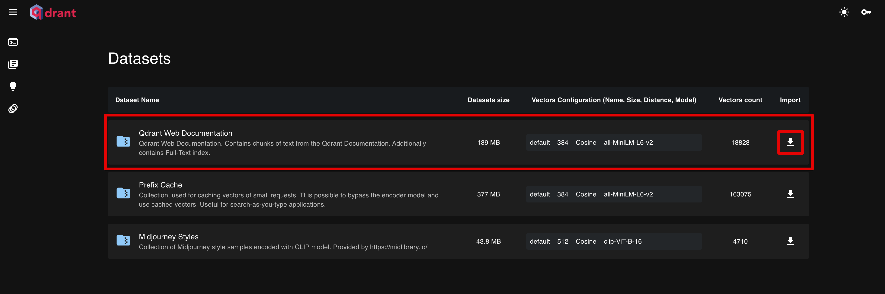

# learn-qdrant
Qdrant の学習用。

[](https://github.com/codespaces/new?hide_repo_select=true&ref=main&repo=686856069&skip_quickstart=true)

## Usage

depends on:
- Python: 3.11.2
- pip: 22.3.1
- GNU Make: 3.81

support:
- OS: M1 Macbook Air Ventura 13.4.1

## Gettig Started
First of all, install VSCode recommended extensions. This includes Linter, Formatter, and so on. Recommendation settings is written on `.vscode/extensions.json`.

Make `venv`:

```
python -m venv .venv && . .venv/bin/activate
```

Install dependeincies:

```
pip install -r requirements.txt
```

Duplicate `.env`:

```
cp .env.sample .env
echo '.env is created. please set env.'
```

And edit `.env` manually.

Then, install Docker dependencies:

```bash
make setup
```

### Use

Qdrant サーバを立ち上げます。

```bash
make serve
```

Qdrant ダッシュボードを開き（ http://localhost:6333/dashboard ）サンプルデータであるQdrantのドキュメントをインストールします。



APIサーバーを立ち上げます。

```bash
make start
```

これで API Server を使った検索の準備が整いました。
ブラウザを開き、試しに「チャットボット　メモリ管理」を検索してみましょう。
`http://127.0.0.1:8000/search/チャットボット　メモリ管理`

> **Note**
This project *does not* depends on `dotenv-python`. Instead, using below script.
> `set -a && source ./.env && set +a`

## Functions


### First
Set env:

```
set -a && source ./.env && set +a
```

### Register first Vectors

```bash
make seed
```

### Search similer vector

```bash
make search
```

## ハンズオン: Semantic Search
このリポジトリにはLangChainのドキュメント74ページ分のサンプルが付属しています。
`embedding.py`によってそれをVectorDBに登録するテストを体験しましょう。
サンプルデータの登録を行うには、以下のコマンドを実行します。

```bash
python src/usecases/vectorize_article.py
```

このサンプルデータに対してセマンティック検索を行えることを確認します。
以下を実行してください。

```bash
python src/cli/repl_semantic_search.py
```

以下のように対話的に検索を実行することができます。

```
=== 🤖セマンティック検索を開始します。 ===

検索ワードを入力してください。 (例:「チャットボット メモリ管理」「データ タグ 分類」「データベース 連携」)

🔍 検索ワード: チャットボット メモリ管理
```

検索ワードを打ち込むと、類似度が高い順に上位二件の検索結果が表示されます、表示されたURLを確認してセマンティック検索ができていることを確認してみましょう。

```
あなたの検索ワード:
    - チャットボット メモリ管理

✅ 検索結果:

    - 0th:
        - 記事タイトル: memory_management
        - 記事URL: https://python.langchain.com/docs/use_cases/chatbots/memory_management
        - 類似度スコア(dot product): 0.35029587
        - 記事ID: 2
        - バージョン: 74

    - 1th:
        - 記事タイトル: index
        - 記事URL: https://python.langchain.com/docs/use_cases/chatbots/index
        - 類似度スコア(dot product): 0.32134968
        - 記事ID: 1
        - バージョン: 74
```

CLIではなくコードによって検索を実行したい場合、`search.py` の `search` メソッドを用いてください。


> **Note**
> `repl_semantic_search.py` も内部的には `search.py` を利用しています。

## あなたのっドキュメントを使用してセマンティック検索機能を実装する
あなたのドキュメントを使用してセマンティック検索エンジンを実装したい場合、大まかには下記の手順で実装します。

- VectorDBにインポートしたいデータを5データ以上程度用意する（サンプルは74データ）
- データから、類似度検索に用いる埋め込みベクトルと、検索結果に表示したいメタデータをそれぞれ作成する
- Qdrant に Collection を作成する
- 作成した Collection に埋め込みベクトル・メタデータの組を全てupsertする

このリポジトリのコードに従って上記を実装するには、以下のようにします。

- ドキュメントなどのデータセットを用意する（Qdrantのドキュメントがサンプルとして公開されているので、それを使うと良い）
- `src/dataset` 配下にVectorDBにインポートしたいデータを配置する
- `embedding.py` にて、参照するデータセットのパスを変更する
- `embedding.py` と `search.py` のCollection名を変更する
- `embedding.py` を更新し、メタデータの型を実装する
- `embedding.py` を実行し、VectorDB へのデータインポートを行う

上記手順が完了すると、`python src/semantic_search/repl_semantic_search.py` でデータ検索ができるようになります。


## Develop App
On usual develop, first you activate `venv` first like below.

```bash
source .venv/bin/activate
```

Save requirements:

```bash
pip freeze > requirements.txt
```

Deactivate venv:

```bash
deactivate
```
